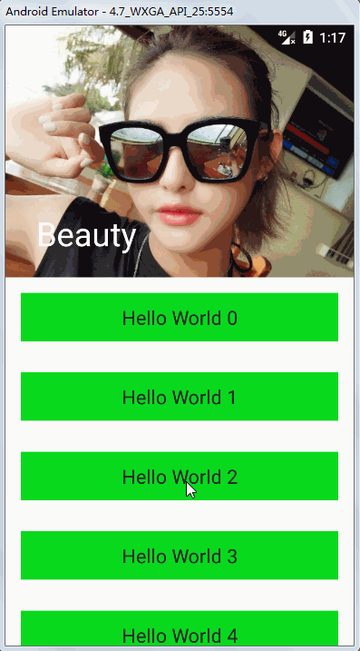

# Material Design #
[Introduce to Material Design](https://www.youtube.com/watch?v=p4gmvHyuZzw)

[官网](https://material.io/)

## 环境 ##
[Environment](https://material.io/guidelines/material-design/environment.html)
## 材质属性 ##
 [Material properties](https://material.io/guidelines/material-design/material-properties.html)
## 升高与阴影 ##
[Elevation & Shadows](https://material.io/guidelines/material-design/elevation-shadows.html)

### translationZ ###
    <View
        android:layout_width="100dp"
        android:layout_height="100dp"
        android:layout_margin="8dp"
        android:translationZ="8dp"
        android:background="@color/colorAccent"/>
### elevation ###
    <View
        android:layout_width="100dp"
        android:layout_height="100dp"
        android:layout_margin="8dp"
        android:translationZ="8dp"
        android:elevation="8dp"
        android:background="@color/colorAccent"/>

### translation + elevation ###
    <View
        android:layout_width="100dp"
        android:layout_height="100dp"
        android:layout_margin="8dp"
        android:translationZ="8dp"
        android:elevation="8dp"
        android:background="@color/colorAccent"/>

# 动作 #
[Motion](https://material.io/guidelines/motion/material-motion.html)
## 水波纹 ##
	<?xml version="1.0" encoding="utf-8"?>
	<LinearLayout xmlns:android="http://schemas.android.com/apk/res/android"
	              android:orientation="vertical"
	              android:layout_width="match_parent"
	              android:layout_height="match_parent">
	    <Button
	        android:layout_width="match_parent"
	        android:layout_height="wrap_content"
	        android:layout_margin="8dp"
	        android:text="默认"/>
	    <Button
	        android:layout_width="match_parent"
	        android:layout_height="wrap_content"
	        android:layout_margin="8dp"
	        android:background="?selectableItemBackground"
	        android:text="有边界"/>
	    <Button
	        android:layout_width="match_parent"
	        android:layout_height="wrap_content"
	        android:layout_margin="8dp"
	        android:background="?selectableItemBackgroundBorderless"
	        android:text="无边界"/>
	</LinearLayout>

## 转场动画 ##
[Material Animation](https://github.com/lgvalle/Material-Animations/)

### Slide动画 ###
	//TransitionAnimationActivity
    public void onSlide(View view) {
        ActivityOptionsCompat activityOptionsCompat = ActivityOptionsCompat.makeSceneTransitionAnimation(this);
        Intent intent = new Intent(this, SlideActivity.class);
        ActivityCompat.startActivity(this, intent, activityOptionsCompat.toBundle());
    }

	//SlideActivity
    @Override
    protected void onCreate(@Nullable Bundle savedInstanceState) {
        super.onCreate(savedInstanceState);
        setContentView(R.layout.activity_slide);
        if (android.os.Build.VERSION.SDK_INT >= android.os.Build.VERSION_CODES.LOLLIPOP) {
            Slide slide = new Slide();
            slide.setSlideEdge(Gravity.RIGHT);//从右边滑入屏幕
            slide.setDuration(1000);
            getWindow().setEnterTransition(slide);
        }
    }

### Fade动画 ###
	//TransitionAnimationActivity
    public void onFade(View view) {
        Bundle bundle = ActivityOptionsCompat.makeSceneTransitionAnimation(this).toBundle();
        Intent intent = new Intent(this, FadeActivity.class);
        ActivityCompat.startActivity(this, intent, bundle);
    }

	//FadeActivity
    @Override
    protected void onCreate(@Nullable Bundle savedInstanceState) {
        super.onCreate(savedInstanceState);
        setContentView(R.layout.activity_fade);
        if (android.os.Build.VERSION.SDK_INT >= Build.VERSION_CODES.LOLLIPOP) {
            Fade fade = new Fade(Visibility.MODE_IN);//淡入
            fade.setDuration(1000);
            getWindow().setEnterTransition(fade);
        }
    }

### Explode动画 ###
    //TransitionAnimationActivity
    public void onExplode(View view) {
        Bundle bundle = ActivityOptionsCompat.makeSceneTransitionAnimation(this).toBundle();
        Intent intent = new Intent(this, ExplodeActivity.class);
        ActivityCompat.startActivity(this, intent, bundle);
    }
	
	//ExplodeActivity
    @Override
    protected void onCreate(@Nullable Bundle savedInstanceState) {
        super.onCreate(savedInstanceState);
        setContentView(R.layout.activity_exploded);

        if (android.os.Build.VERSION.SDK_INT >= android.os.Build.VERSION_CODES.LOLLIPOP) {
            Explode explode = new Explode();
            explode.setDuration(1000);
            getWindow().setEnterTransition(explode);
        }
    }

### Share Element动画 ###
#### 开启内容转场 ####
	<resources>
	    
	</resources>

#### 配置共享元素 ####
使用transitionName配置共享元素

	//activity_transistion_animation.xml
    <LinearLayout
        android:layout_width="match_parent"
        android:layout_height="wrap_content"
        android:orientation="horizontal"
        android:layout_margin="20dp">

        <View
            android:id="@+id/red_circle"
            android:layout_width="50dp"
            android:layout_height="50dp"
            android:background="@drawable/circle_bg"
            android:onClick="onShareElement"
            android:transitionName="@string/red_name"/>

        <TextView
            android:layout_width="wrap_content"
            android:layout_height="wrap_content"
            android:textSize="20sp"
            android:text="Share Element"
            android:layout_gravity="center_vertical"
            android:layout_marginLeft="10dp"/>
    </LinearLayout>

	//activity_share_element
	<FrameLayout
	    xmlns:android="http://schemas.android.com/apk/res/android"
	    android:id="@+id/root"
	    android:layout_width="match_parent"
	    android:layout_height="match_parent"
	    android:background="@android:color/holo_green_light">
	
	    <View
	        android:layout_width="100dp"
	        android:layout_height="100dp"
	        android:layout_gravity="center"
	        android:layout_margin="10dp"
	        android:background="@drawable/circle_bg"
	        android:transitionName="@string/red_name"/>
	
	</FrameLayout>

#### 开始转场 ####
	//TransitionAnimationActivity
    public void onShareElement(View view) {
        Bundle bundle = ActivityOptionsCompat
                .makeSceneTransitionAnimation(this, view, getString(R.string.red_name))
                .toBundle();
        Intent intent = new Intent(this, ShareElementActivity.class);
        ActivityCompat.startActivity(this, intent, bundle);
    }

#### 配置转场路径 ####
    @Override
    protected void onCreate(@Nullable Bundle savedInstanceState) {
        super.onCreate(savedInstanceState);
        setContentView(R.layout.activity_share_element);

        mRoot = (FrameLayout) findViewById(R.id.root);

        if (Build.VERSION.SDK_INT >= Build.VERSION_CODES.LOLLIPOP) {
            ChangeBounds changeBounds = new ChangeBounds();
            changeBounds.setPathMotion(new ArcMotion());
            changeBounds.addListener(mTransitionListener);
            getWindow().setSharedElementEnterTransition(changeBounds);
        }
    }

#### 转场后播放涟漪 ####
    private Transition.TransitionListener mTransitionListener = new Transition.TransitionListener() {
		
		//转场结束
        @Override
        public void onTransitionEnd(Transition transition) {
            if (Build.VERSION.SDK_INT >= Build.VERSION_CODES.LOLLIPOP) {
                animateRevealColorFromCoordinates(mRoot, R.color.colorAccent);
            }
        }
    };

    @RequiresApi(api = Build.VERSION_CODES.LOLLIPOP)
    private Animator animateRevealColorFromCoordinates(ViewGroup viewRoot, @ColorRes int color) {
        float finalRadius = (float) Math.max(viewRoot.getWidth(), viewRoot.getHeight());
        int x = viewRoot.getWidth() / 2;
        int y = viewRoot.getHeight() / 2;
		//创建涟漪动画
        Animator anim = ViewAnimationUtils.createCircularReveal(viewRoot, x, y, 0, finalRadius);
        viewRoot.setBackgroundColor(ContextCompat.getColor(this, color));
        anim.setDuration(1000);
        anim.setInterpolator(new AccelerateDecelerateInterpolator());
        anim.start();
        return anim;
    }

# 样式 #
[Style](https://material.io/guidelines/style/color.html)

[Color Tool](https://material.io/color/#!/?view.left=0&view.right=0)

[Icons](https://material.io/icons/)

## Tint（着色） ##
    <ImageView
        android:layout_width="wrap_content"
        android:layout_height="wrap_content"
        android:src="@drawable/ic_home_black_48dp"
        android:tint="@color/colorAccent"/>

# 组件 #
## CardView ##
[官网介绍](https://developer.android.com/training/material/lists-cards.html?hl=zh-cn)

	compile 'com.android.support:cardview-v7:26+'

    <android.support.v7.widget.CardView
        android:layout_width="match_parent"
        android:layout_height="200dp"
        android:layout_margin="8dp"
        app:cardCornerRadius="8dp"
        app:contentPadding="8dp">
        <TextView
            android:layout_width="wrap_content"
            android:layout_height="wrap_content"
            android:text="Hello CardView!"/>
    </android.support.v7.widget.CardView>

## RecyclerView ##
[官网介绍](https://developer.android.com/training/material/lists-cards.html?hl=zh-cn)

### 列表样式 ###
	
    @Override
    protected void onCreate(@Nullable Bundle savedInstanceState) {
        super.onCreate(savedInstanceState);
        setContentView(R.layout.activity_recyclerview);
        RecyclerView recyclerView = (RecyclerView) findViewById(R.id.recycler_view);
        recyclerView.setHasFixedSize(true);
        recyclerView.setLayoutManager(new LinearLayoutManager(this));
        recyclerView.setAdapter(new RecyclerViewListAdapter(this));
    }

	public class RecyclerViewListAdapter extends RecyclerView.Adapter<RecyclerView.ViewHolder> {
	
	    private Context mContext;
	
	    public RecyclerViewListAdapter(Context context) {
	        mContext = context;
	    }
	
	    @Override
	    public RecyclerView.ViewHolder onCreateViewHolder(ViewGroup parent, int viewType) {
	        View item = LayoutInflater.from(mContext).inflate(R.layout.recyclerview_item, parent, false);
	        return new MyViewHolder(item);
	    }
	
	    @Override
	    public void onBindViewHolder(RecyclerView.ViewHolder holder, int position) {
	        TextView tv = (TextView) holder.itemView.findViewById(R.id.tv);
	        tv.setText("Hello World " + position);
	    }
	
	    @Override
	    public int getItemCount() {
	        return 30;
	    }
	
	    private static class MyViewHolder extends RecyclerView.ViewHolder {
	
	        public MyViewHolder(View itemView) {
	            super(itemView);
	        }
	    }
	}

### 网格形式 ###
    @Override
    protected void onCreate(@Nullable Bundle savedInstanceState) {
        super.onCreate(savedInstanceState);
        setContentView(R.layout.activity_recyclerview);
        RecyclerView recyclerView = (RecyclerView) findViewById(R.id.recycler_view);
        recyclerView.setHasFixedSize(true);
        recyclerView.setLayoutManager(new GridLayoutManager(this, 2));
        recyclerView.setAdapter(new RecyclerViewListAdapter(this));
    }

### 瀑布流形式 ###
    @Override
    protected void onCreate(@Nullable Bundle savedInstanceState) {
        super.onCreate(savedInstanceState);
        setContentView(R.layout.activity_recyclerview);
        RecyclerView recyclerView = (RecyclerView) findViewById(R.id.recycler_view);
        recyclerView.setHasFixedSize(true);
        recyclerView.setLayoutManager(new StaggeredGridLayoutManager(2, StaggeredGridLayoutManager.VERTICAL));
        recyclerView.setAdapter(new RecyclerViewStaggeredAdapter(this));
    }

	public class RecyclerViewStaggeredAdapter extends RecyclerView.Adapter<RecyclerView.ViewHolder> {
	
	    @Override
	    public void onBindViewHolder(RecyclerView.ViewHolder holder, int position) {
	        TextView tv = (TextView) holder.itemView.findViewById(R.id.tv);
	        tv.setHeight(100 + new Random().nextInt(200));//随机高度
	        tv.setText("Hello World " + position);
	    }
	
	}

## FloatingActionButton ##
    <android.support.design.widget.FloatingActionButton
        android:id="@+id/floating_action_button"
        android:layout_width="wrap_content"
        android:layout_height="wrap_content"
        android:layout_gravity="bottom|end"
        android:src="@android:drawable/ic_input_add"
        android:onClick="onFloatingActionButtonClick"
        android:layout_margin="16dp"/>

## SnackBar ##
    public void onShowSnackbar(View view) {
        FrameLayout frameLayout = (FrameLayout) findViewById(R.id.frame_layout);
        Snackbar.make(frameLayout, R.string.app_name, 2000)
                .setAction("Action", new View.OnClickListener() {
                    @Override
                    public void onClick(View v) {
                        Toast.makeText(SnackbarActivity.this, "Action Click", Toast.LENGTH_SHORT).show();
                    }
                })
                .setText("Message")
                .show();
    }

## CoordinatorLayout ##
### Snackbar和FloatingActionButton ###
	<android.support.design.widget.CoordinatorLayout
	    xmlns:android="http://schemas.android.com/apk/res/android"
	    xmlns:app="http://schemas.android.com/apk/res-auto"
	    android:id="@+id/coordinator_layout"
	    android:layout_width="match_parent"
	    android:layout_height="match_parent">
	
	
	    <android.support.design.widget.FloatingActionButton
	        android:id="@+id/floating_action_button"
	        android:layout_width="wrap_content"
	        android:layout_height="wrap_content"
	        android:layout_gravity="bottom|end"
	        android:layout_margin="16dp"
	        android:onClick="onFloatingActionButtonClick"/>
	
	</android.support.design.widget.CoordinatorLayout>

    public void onFloatingActionButtonClick(View view) {
        Snackbar.make(findViewById(R.id.coordinator_layout), R.string.app_name, 2000)
                .setAction("Action", new View.OnClickListener() {
                    @Override
                    public void onClick(View v) {
                        Toast.makeText(CoordinatorLayoutActivity.this,
						 "Action Click", Toast.LENGTH_SHORT).show();
                    }
                })
                .setText("Message")
                .show();
    }

### RecyclerView和FloatingActionButton ###
使用layout_behavior指定FloatingAtionButton的行为

	<android.support.design.widget.CoordinatorLayout
	    xmlns:android="http://schemas.android.com/apk/res/android"
	    xmlns:app="http://schemas.android.com/apk/res-auto"
	    android:id="@+id/coordinator_layout"
	    android:layout_width="match_parent"
	    android:layout_height="match_parent">
	
	    <android.support.v7.widget.RecyclerView
	        android:id="@+id/recycler_view"
	        android:layout_width="match_parent"
	        android:layout_height="match_parent">
	    </android.support.v7.widget.RecyclerView>
	
	    <android.support.design.widget.FloatingActionButton
	        android:id="@+id/floating_action_button"
	        android:layout_width="wrap_content"
	        android:layout_height="wrap_content"
	        android:layout_gravity="bottom|end"
	        android:layout_margin="16dp"
	        android:onClick="onFloatingActionButtonClick"
	        android:src="@android:drawable/ic_input_add"
	        app:layout_behavior="com.example.leon.newfeaturedemo.behavior.FloatingActionButtonBehavior"/>
	
	</android.support.design.widget.CoordinatorLayout>

	//FloatingActionButton行为
	public class FloatingActionButtonBehavior extends FloatingActionButton.Behavior {
	
	    public FloatingActionButtonBehavior(Context context, AttributeSet attributeSet){
	        super();
	    }
	
	    @Override
	    public boolean onStartNestedScroll(CoordinatorLayout coordinatorLayout,
	                                       FloatingActionButton child, View directTargetChild,
	                                       View target, int nestedScrollAxes) {
	        return nestedScrollAxes == ViewCompat.SCROLL_AXIS_VERTICAL ||
	                super.onStartNestedScroll(coordinatorLayout, child, directTargetChild, target, nestedScrollAxes);
	    }
	
	    @Override
	    public void onNestedScroll(CoordinatorLayout coordinatorLayout, final FloatingActionButton child,
	                               View target, int dxConsumed, int dyConsumed,
	                               int dxUnconsumed, int dyUnconsumed) {
	        if (dyConsumed > 0 && child.getVisibility() == View.VISIBLE) {
	            Log.d(TAG, "onNestedScroll: hide");
	            child.hide(new FloatingActionButton.OnVisibilityChangedListener() {
	                @Override
	                public void onHidden(FloatingActionButton fab) {
	                    super.onHidden(fab);
	                    child.setVisibility(View.INVISIBLE);
	                }
	            });
	        } else if (dyConsumed < 0 && child.getVisibility() != View.VISIBLE) {
	            Log.d(TAG, "onNestedScroll: show");
	            child.show();
	        }
	    }
	}

## Toolbar ##
	//去除Actionbar
    <activity android:name=".ToolbarActivity"
            android:theme="@style/Theme.AppCompat.Light.NoActionBar"/>

    <android.support.v7.widget.Toolbar
        android:id="@+id/tool_bar"
        android:layout_width="match_parent"
        android:layout_height="wrap_content"
        android:background="@color/colorPrimary"
        android:theme="@style/ThemeOverlay.AppCompat.Dark.ActionBar"
        app:popupTheme="@style/ThemeOverlay.AppCompat.Light">
    </android.support.v7.widget.Toolbar>

	//初始化
    @Override
    protected void onCreate(@Nullable Bundle savedInstanceState) {
        super.onCreate(savedInstanceState);
        setContentView(R.layout.activity_toolbar);

        Toolbar toolbar = (Toolbar) findViewById(R.id.tool_bar);
        setSupportActionBar(toolbar);

        ActionBar supportActionBar = getSupportActionBar();
        supportActionBar.setTitle("MyTitle");
    }

	//创建菜单
    @Override
    public boolean onCreateOptionsMenu(Menu menu) {
        getMenuInflater().inflate(R.menu.my_menu, menu);
        return true;
    }

## AppBarLayout ##
AppLayout为LinearLayout子类，它主要用来控制孩子的滚动效果，它必须放在CoordinatorLayout内部。
layout_scrollFlags指定孩子滚动的效果。

### scroll ##
AppBarLayout的Child View 伴随着滚动事件而滚出或滚进屏幕。注意两点：第一点，如果使用了其他值，必定要使用这个值才能起作用；第二点：如果在这个child View前面的任何其他Child View没有设置这个值，那么这个Child View的设置将失去作用。

	<android.support.design.widget.CoordinatorLayout
	    xmlns:android="http://schemas.android.com/apk/res/android"
	    xmlns:app="http://schemas.android.com/apk/res-auto"
	    android:id="@+id/coordinator_layout"
	    android:layout_width="match_parent"
	    android:layout_height="match_parent">
	
	    <android.support.design.widget.AppBarLayout
	        android:layout_width="match_parent"
	        android:layout_height="wrap_content">

	        <android.support.v7.widget.Toolbar
	            android:id="@+id/tool_bar"
	            android:layout_width="match_parent"
	            android:layout_height="wrap_content"
	            android:background="@color/colorPrimary"
	            android:theme="@style/ThemeOverlay.AppCompat.Dark.ActionBar"
	            app:layout_scrollFlags="scroll"
	            app:popupTheme="@style/ThemeOverlay.AppCompat.Light">
	        </android.support.v7.widget.Toolbar>
	
	    </android.support.design.widget.AppBarLayout>
	
	    <android.support.v7.widget.RecyclerView
	        android:id="@+id/recycler_view"
	        android:layout_width="match_parent"
	        android:layout_height="match_parent"
	        app:layout_behavior="@string/appbar_scrolling_view_behavior">
	    </android.support.v7.widget.RecyclerView>
	
	
	</android.support.design.widget.CoordinatorLayout>

### scroll|enterAlways ##
快速返回模式。其实就是向下滚动时Scrolling View(如RecyclerView)和Child View(如Toolbar)之间的滚动优先级问题。对比scroll和scroll | enterAlways设置，发生向下滚动事件时，前者优先滚动Scrolling View，后者优先滚动Child View，当优先滚动的一方已经全部滚进屏幕之后，另一方才开始滚动。

    <android.support.v7.widget.Toolbar
        android:id="@+id/tool_bar"
        android:layout_width="match_parent"
        android:layout_height="wrap_content"
        android:background="@color/colorPrimary"
        android:theme="@style/ThemeOverlay.AppCompat.Dark.ActionBar"
        app:layout_scrollFlags="scroll|enterAlways"
        app:popupTheme="@style/ThemeOverlay.AppCompat.Light">
    </android.support.v7.widget.Toolbar>

### scroll|enterAlways|enterAlwaysCollapse ##
enterAlways的附加值。这里涉及到Child View的高度和最小高度，向下滚动时，Child View先向下滚动最小高度值，然后Scrolling View开始滚动，到达边界时，Child View再向下滚动，直至显示完全。

    <android.support.v7.widget.Toolbar
        android:id="@+id/tool_bar"
        android:layout_width="match_parent"
        android:layout_height="200dp"
        android:minHeight="50dp"
        android:background="@color/colorPrimary"
        android:theme="@style/ThemeOverlay.AppCompat.Dark.ActionBar"
        app:layout_scrollFlags="scroll|enterAlways|enterAlwaysCollapsed"
        app:popupTheme="@style/ThemeOverlay.AppCompat.Light">
    </android.support.v7.widget.Toolbar>

### scoll|exitUntilCollapsed ##
这里也涉及到最小高度。发生向上滚动事件时，Child View向上滚动退出直至最小高度，然后Scrolling View开始滚动。也就是，Child View不会完全退出屏幕。

    <android.support.v7.widget.Toolbar
        android:id="@+id/tool_bar"
        android:layout_width="match_parent"
        android:layout_height="200dp"
        android:minHeight="50dp"
        android:background="@color/colorPrimary"
        android:theme="@style/ThemeOverlay.AppCompat.Dark.ActionBar"
        app:layout_scrollFlags="scroll|exitUntilCollapsed"
        app:popupTheme="@style/ThemeOverlay.AppCompat.Light">
    </android.support.v7.widget.Toolbar>

### scroll|snap ##
简单理解，就是Child View滚动比例的一个吸附效果。也就是说，Child View不会存在局部显示的情况，滚动Child View的部分高度，当我们松开手指时，Child View要么向上全部滚出屏幕，要么向下全部滚进屏幕，有点类似ViewPager的左右滑动。

        <android.support.v7.widget.Toolbar
            android:id="@+id/tool_bar"
            android:layout_width="match_parent"
            android:layout_height="200dp"
            android:minHeight="50dp"
            android:background="@color/colorPrimary"
            android:theme="@style/ThemeOverlay.AppCompat.Dark.ActionBar"
            app:layout_scrollFlags="scroll|snap"
            app:popupTheme="@style/ThemeOverlay.AppCompat.Light">
        </android.support.v7.widget.Toolbar>

## CollapsingToolbarLayout ##
CollapsingToolbarLayout继承自FrameLayout,用它来包裹一个Toolbar,实现折叠Toolbar的效果。它一般作为AppBarLayout的直接子类使用。

	<?xml version="1.0" encoding="utf-8"?>
	<android.support.design.widget.CoordinatorLayout
	    xmlns:android="http://schemas.android.com/apk/res/android"
	    xmlns:app="http://schemas.android.com/apk/res-auto"
	    android:id="@+id/coordinator_layout"
	    android:layout_width="match_parent"
	    android:layout_height="match_parent"
	    android:fitsSystemWindows="true">
	
	    <android.support.design.widget.AppBarLayout
	        android:layout_width="match_parent"
	        android:layout_height="260dp"
	        android:fitsSystemWindows="true">
	
	        <android.support.design.widget.CollapsingToolbarLayout
	            android:id="@+id/collapsing_toolbar_layout"
	            android:layout_width="match_parent"
	            android:layout_height="match_parent"
	            app:layout_scrollFlags="scroll|exitUntilCollapsed|snap"
	            android:theme="@style/ThemeOverlay.AppCompat.Dark.ActionBar"
	            app:contentScrim="@color/colorPrimary"
	            app:statusBarScrim="@color/colorPrimaryDark">
	
	            <ImageView
	                android:layout_width="match_parent"
	                android:layout_height="match_parent"
	                android:src="@drawable/girl"
	                app:layout_collapseMode="parallax"
	                android:scaleType="centerCrop"
	                android:fitsSystemWindows="true"
	                android:layout_gravity="center"/>
	
	            <android.support.v7.widget.Toolbar
	                android:id="@+id/tool_bar"
	                android:layout_width="match_parent"
	                android:layout_height="?android:actionBarSize"
	                app:layout_collapseMode="pin"
	                app:popupTheme="@style/ThemeOverlay.AppCompat.Light">
	            </android.support.v7.widget.Toolbar>
	
	        </android.support.design.widget.CollapsingToolbarLayout>
	
	    </android.support.design.widget.AppBarLayout>
	
	    <android.support.v7.widget.RecyclerView
	        android:id="@+id/recycler_view"
	        android:layout_width="match_parent"
	        android:layout_height="match_parent"
	        app:layout_behavior="@string/appbar_scrolling_view_behavior">
	    </android.support.v7.widget.RecyclerView>
	
	
	</android.support.design.widget.CoordinatorLayout>

* fitSystemWindows 沉浸式，让布局能够抵达屏幕最顶端
* contentScrim 折叠后背景颜色
* statusBarScrim 折叠后状态栏的颜色

CollapsingToolbarLayout的子布局有3种折叠模式（Toolbar中设置的app:layout_collapseMode）

* off：这个是默认属性，布局将正常显示，没有折叠的行为。
* pin：CollapsingToolbarLayout折叠后，此布局将固定在顶部。
* parallax：CollapsingToolbarLayout折叠时，此布局也会有视差折叠效果。
当CollapsingToolbarLayout的子布局设置了parallax模式时，我们还可以通过app:layout_collapseParallaxMultiplier设置视差滚动因子，值为：0~1。

	
	    @Override
	    protected void onCreate(@Nullable Bundle savedInstanceState) {
	        super.onCreate(savedInstanceState);
	        setContentView(R.layout.activity_collapsing_toolbar_layout);
			........
	
	        CollapsingToolbarLayout collapsingToolbarLayout =
	                (CollapsingToolbarLayout) findViewById(R.id.collapsing_toolbar_layout);
			//设置标题，代理Toolbar标题
	        collapsingToolbarLayout.setTitle("Beauty");
	
	        Toolbar toolbar = (Toolbar) findViewById(R.id.tool_bar);
	        setSupportActionBar(toolbar);
			//设置返回按钮
	        getSupportActionBar().setDisplayHomeAsUpEnabled(true);
	    }
	
		//设置状态栏为透明
	    private void setStatusBarColor() {
	        if (Build.VERSION.SDK_INT >= Build.VERSION_CODES.LOLLIPOP) {
	            Window window = getWindow();
	            window.addFlags(WindowManager.LayoutParams.FLAG_DRAWS_SYSTEM_BAR_BACKGROUNDS);
	            window.setStatusBarColor(Color.TRANSPARENT);
	        }
	    }

## NavigationBottomView ##
    <android.support.design.widget.BottomNavigationView
        android:layout_width="match_parent"
        android:layout_height="wrap_content"
        app:menu="@menu/bottom_menu"
        app:itemTextColor="@color/bottom_menu_selector"
        app:itemIconTint="@color/bottom_menu_selector"
        app:itemBackground="@color/colorPrimary"/>

	<?xml version="1.0" encoding="utf-8"?>
	<menu xmlns:android="http://schemas.android.com/apk/res/android">
	
	    <item android:title="首页"
	        android:icon="@mipmap/ic_launcher"/>
	
	    <item android:title="发现"
	        android:icon="@mipmap/ic_launcher"/>
	
	    <item android:title="联系人"
	        android:icon="@mipmap/ic_launcher"/>
	
	</menu>

## BottomSheetDialog ##
    public void onShowBottomSheetDialog(View view) {
        mBottomSheetDialog = new BottomSheetDialog(this);
        mBottomSheetDialog.setContentView(R.layout.view_bottom_sheet);
        mBottomSheetDialog.show();

    }

    public void onHelloWorld(View view) {
        Toast.makeText(this, "Hello World", Toast.LENGTH_SHORT).show();
        mBottomSheetDialog.dismiss();
    }

## TextInputLayout ##
	<?xml version="1.0" encoding="utf-8"?>
	<LinearLayout xmlns:android="http://schemas.android.com/apk/res/android"
	              android:orientation="vertical"
	              android:layout_width="match_parent"
	              android:layout_height="match_parent"
	    android:padding="8dp">
	
	    <android.support.design.widget.TextInputLayout
	        android:layout_width="match_parent"
	        android:layout_height="wrap_content">
	
	        <android.support.design.widget.TextInputEditText
	            android:layout_width="match_parent"
	            android:layout_height="wrap_content"
	            android:hint="用户名"/>
	    </android.support.design.widget.TextInputLayout>
	
	    <android.support.design.widget.TextInputLayout
	        android:layout_width="match_parent"
	        android:layout_height="wrap_content">
	
	        <android.support.design.widget.TextInputEditText
	            android:layout_width="match_parent"
	            android:layout_height="wrap_content"
	            android:hint="密码"/>
	    </android.support.design.widget.TextInputLayout>
	
	
	</LinearLayout>

## SwipeRefreshLayout ##
        SwipeRefreshLayout swipeRefreshLayout = (SwipeRefreshLayout) findViewById(R.id.swipe_refresh_layout);
        swipeRefreshLayout.setColorSchemeResources(R.color.colorAccent, R.color.colorPrimary, R.color.colorPrimaryDark);

        swipeRefreshLayout.setOnRefreshListener(new SwipeRefreshLayout.OnRefreshListener() {
            @Override
            public void onRefresh() {
                //开始刷新数据
            }
        });

## TabLayout ##
    <android.support.design.widget.TabLayout
        android:id="@+id/tab_layout"
        android:layout_width="match_parent"
        android:layout_height="wrap_content"
        app:tabBackground="@color/colorPrimary"
        app:tabSelectedTextColor="@android:color/white"
        app:tabTextColor="#30ffffff"
        app:tabIndicatorColor="@android:color/white"
        app:tabIndicatorHeight="4dp">
    </android.support.design.widget.TabLayout>

## NavigationView ##
	<android.support.v4.widget.DrawerLayout
	    xmlns:android="http://schemas.android.com/apk/res/android"
	    xmlns:app="http://schemas.android.com/apk/res-auto"
	    android:layout_width="match_parent"
	    android:layout_height="match_parent">
	
	    <android.support.design.widget.NavigationView
	        android:layout_width="match_parent"
	        android:layout_height="match_parent"
	        android:layout_gravity="start"
	        app:headerLayout="@layout/header"
	        app:menu="@menu/menu_navigation">
	    </android.support.design.widget.NavigationView>
	
	    <TextView
	        android:layout_width="match_parent"
	        android:layout_height="match_parent"
	        android:gravity="center"
	        android:text="Hello"/>
	
	</android.support.v4.widget.DrawerLayout>
